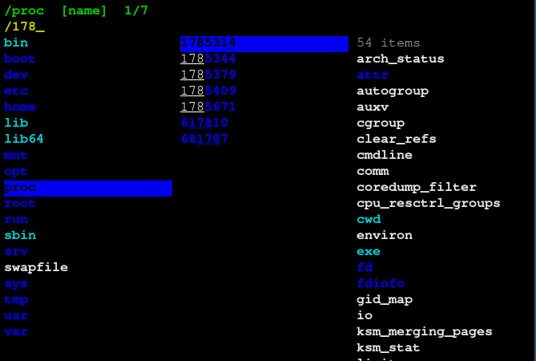

## Overview

Directory Switcher is a keyboard-driven terminal file navigator written in
Rust. It presents a three-pane view (parent directory, current directory, and a
preview of the selected item) allowing fast, intuitive navigation through the
filesystem without leaving the terminal.

When you quit the tool, it writes the current directory to a temporary file and
a shell function (`ds`) reads it back to `cd` into the selected location. This
makes it a practical replacement for `cd` when you need to explore before
committing to a destination.

The tool supports filtering entries by typing, sorting by name, size, or
modification time, bookmarking frequently visited directories, and opening
files directly in `$EDITOR`.

  

## Features

- Three-pane view: parent, current, and child/preview
- Real-time fuzzy filter with match highlighting
- Sort by name, size, or modification time
- Bookmarks with persistent storage
- Navigation history (back/forward)
- File preview for text files; symlink resolution
- Open files in `$EDITOR` without leaving the navigator
- Toggle hidden files
- Mouse support (click to navigate, scroll to move)
- File metadata display (permissions, size, modification time)
- Fully remappable keybindings via config file

## Keybindings

| Key | Action |
|---|---|
| `j` / `k`, `↑` / `↓` | Move down / up |
| `h` / `l`, `←` / `→` | Go to parent / child directory |
| `Alt+←` / `Alt+→` | Navigate back / forward in history |
| `g` / `G` | Jump to first / last entry |
| `Ctrl+D` / `Ctrl+U`, `PgDn` / `PgUp` | Half-page down / up |
| `~` | Go to `$HOME` |
| `.` | Toggle hidden files |
| `/` | Start filter mode |
| `s` | Cycle sort mode (name → size → mtime) |
| `[` / `]` | Scroll file preview up / down |
| `o` | Open file in `$EDITOR` |
| `m` / `M` | Add / remove bookmark for current directory |
| `'` | Jump to next bookmark |
| `B` | Show bookmark list |
| `?` | Toggle help overlay |
| `q` | Quit and `cd` to current directory |

## Installation

## Configuration

## Dependencies

## License

This work is licensed under the GNU General Public License version 3 (GPLv3).

